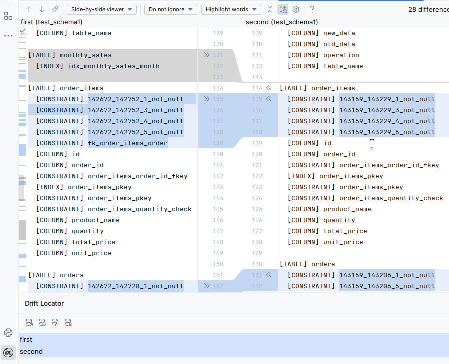

# Drift Locator

[](https://github.com/yamert89/drift-locator/releases)
[](https://plugins.jetbrains.com/plugin/31138-drift-locator)
[](https://www.jetbrains.com/idea/)
[](https://www.postgresql.org/)
[](https://www.mysql.com/)
[](https://www.sqlite.org/)

**Drift Locator** is an IntelliJ IDEA plugin.
<!-- Plugin description -->
Provides database schema comparison across different instances. It helps developers identify differences between diferent environments, ensuring smooth deployments and early detection of schema drift.

> **Note:** Drift Locator currently supports PostgreSQL 12+, MySQL 8.0+, and SQLite 3.x. Metadata coverage is database-specific and may differ by object type.

## Features

- **Schema Comparison** — Compare database schemas between two instances
- **Comprehensive Object Support**:
  - PostgreSQL: tables, views, materialized views, functions, procedures, sequences, triggers, domains, enums, policies, comments, grants, and more
  - MySQL: tables, views, routines, triggers, events, partitions, grants, users, and more
  - SQLite: tables, columns, indexes, foreign keys, views, triggers, generated columns, and DDL-only table options such as `STRICT` and `WITHOUT ROWID`
- **Visual Diff Viewer** — Built-in IntelliJ IDEA diff viewer for side-by-side schema comparison
- **Export Reports** — Automatic export of schema snapshots to text files in your project
- **Multiple Connections** — Manage and compare multiple database connections within your project

## Requirements

- **IntelliJ IDEA**: 2024.1 or later (build 241+)
- **PostgreSQL**: 12 or later
- **MySQL**: 8.0 or later
- **SQLite**: 3.x database files

## Getting Started

### Installation

#### From JetBrains Marketplace

1. Open IntelliJ IDEA
2. Go to **Settings/Preferences** → **Plugins** → **Marketplace**
3. Search for "Drift Locator"
4. Click **Install**
5. Restart the IDE

#### Manual Installation

1. Download the latest plugin distribution `.zip` file from [Releases](https://github.com/yamert89/drift-locator/releases)
2. Open IntelliJ IDEA
3. Go to **Settings/Preferences** → **Plugins** → **⚙️** → **Install from Disk...**
4. Select the downloaded `.zip` file
5. Restart the IDE

### Usage

1. Open the Drift Locator tool window from **View** → **Tool Windows** → **Drift Locator**
2. Add database connections using the **Add Connection** button
3. Select two connections and click **Compare** to analyze schema differences
4. Review results in the built-in Diff Viewer and exported snapshot files
5. To perform a repeatable diff, select stored files (see [File locations](#file-locations)) and press Ctrl+D

Connection settings include standard database credentials for PostgreSQL/MySQL and a database file picker for SQLite. Default values are automatically populated from your last connection to speed up configuration.



#### Managing Connections

- **Edit** — Select a connection and click "Edit Connection" to change database-specific settings
- **Delete** — Select a connection and click "Delete" to remove it
- All changes are automatically saved to your project

## File Locations

Schema snapshots are exported to `.driftLocator/YYYY_MM_DD_HH_MM/` directory within your project.

<!-- Plugin description end -->

## Building from Source

```bash
# Clone the repository
git clone https://github.com/yamert89/drift-locator.git
cd drift-locator

# Build all modules
./gradlew buildPlugin
```
The artifact will be located at `jetbrains-plugin/build/distributions/`

## Contributing

Contributions are welcome! Please feel free to submit a Pull Request.

## License

This project is licensed under the MIT License - see the [LICENSE](LICENSE) file for details.

## Support

If you encounter any issues or have feature requests, please [create an issue](https://github.com/yamert89/drift-locator/issues) on GitHub.
